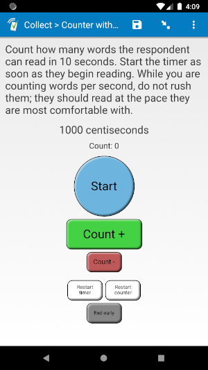
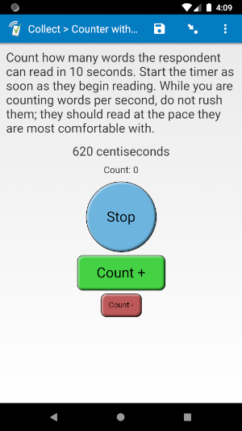
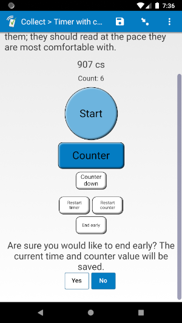
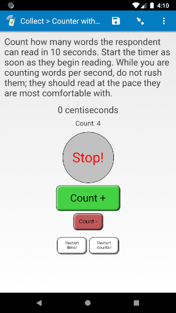

# Counter with timer (in alpha)

*This plug-in is currently being tested, but has so far worked well.*

||||
|:---:|:---:|:---:|
|Running|Warning|Ended|

## Description

Use this plug-in to add a timer to your field. It also includes a counter you can use to keep track of something while timing, with buttons to both count up and count down. The count will never go below 0.

If an enumerator uses one of the restart buttons or the "End early" button, they will have to confirm the restart/ending.

An answer is not set until the timer runs out, or "End early" is confirmed, so the enumerator cannot move on from that field until then. If they "End early", they can come back and continue where they left off with the same amount of time left and the same count value.

You can customize the timer time and unit used. See **Parameters** below for more details.

The value this plug-in returns is a space-separated list:

0. The count on the counter
1. The time that was left

You can use the `selected-at()` function in order to get each individual value. For example, if the field is called "timer1", you can use this expression to get the counter value:

    selected-at(${timer1}, 0)

## Default SurveyCTO feature support

| Feature / Property | Support |
| --- | --- |
| Supported field type(s) | `text`|
| Default values | Yes |
| Custom constraint message | No |
| Custom required message | No |
| Read only | ? |
| media:image | Yes |
| media:audio | Yes |
| media:video | Yes |
| `number` appearance | No |
| `numbers_decimal` appearance | No |
| `numbers_phone` appearance | No |
| `show_formatted` appearance | No |

## How to use

**To use this plug-in as-is**, just download the [countertimer.fieldplugin.zip](countertimer.fieldplugin.zip) file from this repo, and attach it to your form.

To create your own field plug-in using this as a template, follow these steps:

1. Fork this repo
1. Make changes to the files in the `source` directory.

    * **Note:** be sure to update the `manifest.json` file as well.

1. Zip the updated contents of the `source` directory.
1. Rename the .zip file to *yourpluginname*.fieldplugin.zip (replace *yourpluginname* with the name you want to use for your plug-in).
1. You may then attach your new .fieldplugin.zip file to your form as normal.

## Parameters

This field takes two parameters:

1. Time in milliseconds
2. Display unit

For the timer, no matter the unit you are using, the timer must be given in milliseconds. For example, if you would like the time to be 20 seconds, the value of this parameter will be `20000`.

You can use the following display units:  
|**Abbr.**|**Full name**|**Unit in 1 second**|
|:---|:---|:---|
|`s`|seconds|1
|`ds`|deciseconds|10
|`cs`|centiseconds|100
|`ms`|milliseconds|1000

For example, if you use the following *appearance*:

    custom-countertimer(time=15000, unit='cs')

Even though the time entered is 15,000 milliseconds, it will be displayed as "1500 cs" before the timer starts.

## More resources

* **Test form**  
You can find a form definition in this repo here: [extras/test-form](extras/test-form).

* **Developer documentation**  
More instructions for developing and using field plug-ins can be found here: [https://github.com/surveycto/Field-plug-in-resources](https://github.com/surveycto/Field-plug-in-resources)