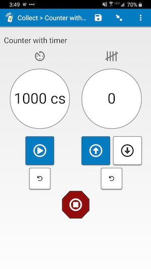
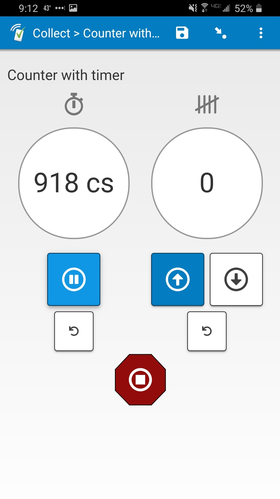
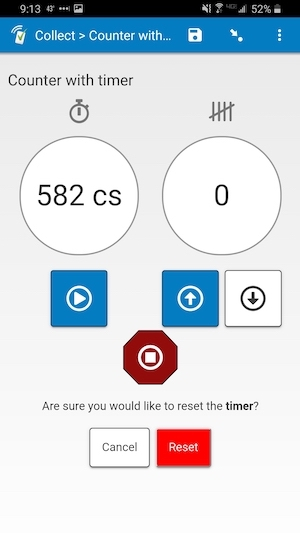
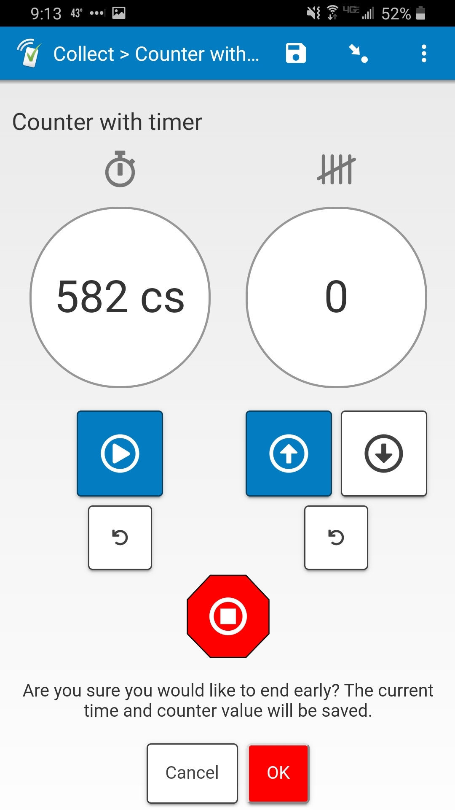
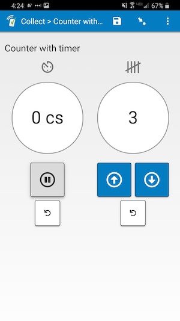

# Counter with timer

|||||
|:---:|:---:|:---:|:---:|
|Running|Warning|End early|Ended|

## Description

Use this field plug-in to add a timer to your field. It also includes a counter you can use to keep track of something while timing, with buttons to both count up and count down. You can use it to count words read, number of mistakes, or whatever else you need to count. The count will never go below 0.

If an enumerator uses one of the reset buttons or the "End early" button (the hex octogon with a circle and square inside), they will have to confirm the reset/ending.

An answer is not set until the timer runs out, or "End early" is confirmed, so the enumerator cannot move on from that field until then. If they leave the field, they can come back and continue where they left off with the same amount of time left and the same count value. If they end early and come back, and the time left and/or counter value is changed, they will need to tap/click the "End early" button again to save a new answer, or let the timer run out.

You can customize the timer duration and unit used. See **Parameters** below for more details.

The value this field plug-in returns is a space-separated list:

0. The count on the counter
1. The time that was left on the timer

You can use the `selected-at()` function in order to get each individual value. For example, if the field is called "timer1", you can use this expression to get the counter value:

    selected-at(${timer1}, 0)

## Default SurveyCTO feature support

| Feature / Property | Support |
| --- | --- |
| Supported field type(s) | `text`|
| Default values | Yes |
| Custom constraint message | No |
| Custom required message | No |
| Read only | No |
| media:image | Yes |
| media:audio | Yes |
| media:video | Yes |
| `number` appearance | No |
| `numbers_decimal` appearance | No |
| `numbers_phone` appearance | No |
| `show_formatted` appearance | No |

## How to use

**To use this plug-in as-is**, just download the [counterwithtimer.fieldplugin.zip](countertimer.fieldplugin.zip) file from this repo, and attach it to your form.

To create your own field plug-in using this as a template, follow these steps:

1. Fork this repo
1. Make changes to the files in the `source` directory.

    * **Note:** be sure to update the `manifest.json` file as well.

1. Zip the updated contents of the `source` directory.
1. Rename the .zip file to *yourpluginname*.fieldplugin.zip (replace *yourpluginname* with the name you want to use for your field plug-in).
1. You may then attach your new .fieldplugin.zip file to your form as normal.

## Parameters

This field takes two parameters:

|Name|Description|
|:---|:---|
|`duration`|Duration in seconds|
|`time-unit`|Display unit for the time|

For the timer, no matter the unit you are using, the duration must be given in seconds. For example, if you would like the duration to be 20 seconds, the value of this parameter will be `20`. If you would like the duration to be 5,500 milliseconds, the parameter should be `5.5`.

If no unit is specified, it will display the time in seconds. If no parameters are specified, it will default to 10 seconds.

You can use the following display units:  
|**Abbr.**|**Full name**|**Unit in 1 second**|
|:---|:---|:---|
|`s`|seconds|1
|`ds`|deciseconds|10
|`cs`|centiseconds|100
|`ms`|milliseconds|1000

For example, if you use the following *appearance*:

    custom-countertimer(duration=15, unit='cs')

Even though the duration entered is 15 seconds, it will be displayed as "1500 cs" before the timer starts.

## More resources

* **Test form**  
You can find a form definition in this repo here: [extras/test-form](extras/test-form).

* **Developer documentation**  
More instructions for developing and using field plug-ins can be found here: [https://github.com/surveycto/Field-plug-in-resources](https://github.com/surveycto/Field-plug-in-resources)